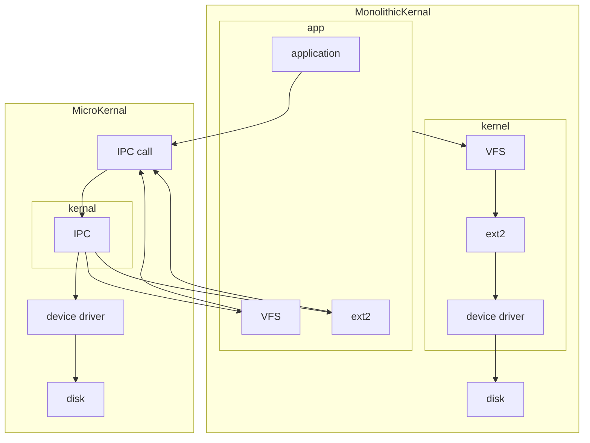

# ref
https://github.com/xuzhongxing/fuchsia-notes
https://xuzhongxing.github.io/201806fuchsia.pdf

# main
## Fuchsia解决现代OS痛点
- `原生进程沙箱`，解决应用安全和分发问题（黑客）
  - Linux: namespace, control group, unionfs => docker
- 稳定的`驱动接口`，硬件厂商可独立维护硬件驱动（硬件）
- 系统模块化，分层，设备厂商可以灵活定制专有系统（友商）
- 基于Vulkan和物理渲染的纯3D UI，全局光照（用户）
- `Flutter`应用开发框架（开发者）
## Fuchsia重新思考四个Unix的基础抽象机制
### 全局文件系统
- 在Unix里，存在一个全局的根文件系统
  - 每个进程共享
  - 涵盖了非文件资源：/proc, /sys, ..
  - 网络是例外
- 在Fuchsia里，没有全局根文件系统
  - 文件和文件系统成为一个局部概念（`局限在每个文件系统进程`里），从而在进程内核数据结构里没有file
  - 用namespace来定义一个进程能够访问的资源
    - 每个name（路径）对应一个资源进程channel 的handle
  - `/` -> root vfs service handle
  - `/dev` -> dev fs service handle
  - `/net/dns` -> DNS service handle
### User
- 在Unix中，user本来是用作不同的用户登录共享服务器的机制
  - user是真正的用户
  - 后来主要用作权限控制，弱化的沙箱机制
- 在Fuchsia中，在底层(Zircon, Garnet)没有用户的概念
  - 用namespace来控制进程能够访问的资源
  - Capability-based access control
  - 从而在进程里没有uid
### 进程的创建
- 在Unix中，新的进程由老的进程fork而来
  - 新的进程继承父进程的全部资源
  - 一种偷懒的设计
- 在Fuchsia中，新进程的创建需要从头开始
  - 创建process, thread
  - 父进程建立初始的namespace到资源channel handle的映射
  - 调用process_start显式的告诉内核新的进程可以跑了
  - 在Fuchsia内核的process数据结构里，没有file和uid
### 系统调用
- nix/Linux里，通过中断调用内核服务： int 0x80, syscall, sysenter系统调用的方式是确定的，直接的
  - 内核接口不能变
  - 可以被任意注入的代码调用
- Zircon里系统调用通过vDSO进行，意图是防止用户代码直接通过固定的中断代码调用system call，达到内核详细接口的隔离。保持C层面的接口稳定：名字+参数。而不是内核入口汇编指令层面的稳定。
  - 注入的代码无法直接调用 vDSO里的接口，虽然加载地址固定，但是计算出入口地址很难，如果不是不可能的话
  - 内核会验证调用指令的地址，而vDSO的加载地址是固定的。并且在编译的时候会验证有限的入口符号，这些符号在编译时唯一生成，防止用户进程绕过vDSO
  - 这里主要的目的是隔离system call的调用方式，不是绝对意义上的不可注入调用
#### 仿佛是专门针对漏洞利用作出的设计
- 典型的漏洞利用步骤
  - 通过系统调用fork()/exec()直接创建反向shell
  - 继承uid(或者通过获得root uid进行提权)获得泛在授权
  - 访问全局文件系统
- 在Fuchsia里，以上机制全都不存在
  - 没有固定的系统调用入口，必须动态链接
  - 创建进程时显式建立root namespace
  - 没有user，从而没有ambient authority (DAC/MAC)
  - Capability-based access control
    - 能访问的资源是父进程赋予的namespace
    - 看不到初始namespace之外的任何资源
## Kernel的本质
- Kernel的本质不是:
  - 管理硬件
  - 执行特权指令
  - 引导启动过程
  - 处理中断
- Kernel的本质是：`地址空间切换`
  - 不同进程唯一共享内存地址空间的场合
    - 切换地址空间是进入内核的标志
    - 不同的进程通过共享内核地址空间来交换信息
    - 切换地址空间是切换进程的关键步骤
## Zircon主要内核态功能
- 虚拟内存和物理内存管理
  - vmo: virtual memory object: 包含物理页
- 进程和线程管理
- 进程间通信
  - channel
### 以内存为中心的设计
- Virtual memory object (vmo)
  - 代表一个内存对象，懒分配
- vmo通过向channel发送handle在进程之间传递
  - 进程拿到vmo handle,把vmo重新映射到自己的地址空间里
- Unix是以文件为中心的设计
### channel
- channel是进程间通信的（唯一）机制
- 一个channel有2个handle，h1, h2，从一头写入消息，从另一头读出消息
- 一个进程在创建时有一些初始channel handle
- 要与一个服务x建立通信，进程创建一个channel，自己拿h1，把h2通过已有的channel(`root_svc`)发送给相应的服务，服务拿到h2，将其放到自己的事件监听循环里
  - 示意api：connectToService(root_svc, “x”, h2)
  - 比如open()，在linux里会在进程的内核数据结构里增加打开的文件描述符，不涉及到其他进程；在fuchsia里则是创建一个channel, 把远端发送给相应的服务，建立通信通道
- channel_write()把消息写到另一个进程能看到的地方。进程间是不共享内存地址空间的。只有内核的地址空间是进程共享的。所以channel_write()必须是一个系统调用，切换到内核地址空间里进行消息写入。一旦切换到内核地址空间里，就能看到另一个handle了。写到那个handle的消息队列里，等另外一个进程切换到内核地址空间里，就能看到消息了。

## 系统调用vDSO
- 内核映像还嵌入了一个vDSO，包含了系统调用入口
- 这个vDSO被映射到每个进程的内存地址空间里
- 它本身是ELF shared object文件格式，但是又不是以文件形态存在，所以叫做vDSO
- Linux kernel也用这种方式实现了一些简单的系统调用，比如getdaytime()。但是Zircon并不是为了避免切换内核态，而是把系统调用的接口用vDSO进行隔离。

## 微内核
- Linus vs Tanenbaum的论战
  - Tanenbaum: Linux是七十年代的技术。在1991年写宏内核是错误的。争论早就结
束了，微内核已经赢了。我是教授，Minix只是我的hobby，所以别拿Minix说事。
  - Linus: Linux比你写的Minix强多了。微内核只是你们学术界的玩具，我看过所有的关于微内核效率优化的论文，它们实际上只是在重复宏内核早就用过的技巧
- Performance overhead
  - Context switching (user space <=> kernel space)
  - Thread scheduling

### Overhead: single core case
- Monolithic
  - CPU0
    - Context switching: 2
- Micro
  - CPU0
    - Context switching: 8
    - Thread scheduling: 4
### Overhead: multicore case
- Monolithic
  - CPU0
    - Context switching: 2
- Micro
  - CPU0
    - Context switching: 2
  - CPU1
    - Context switching: 2
  - CPU2
    - Context switching: 2
  - CPU3
    - Context switching: 2
## Fuchsia在各个平台上的可能的优势
- 在服务器平台上，原生的进程沙箱机制将带来新的安全特性和容器机制
- 在桌面平台上，类似于游戏3D引擎pipeline的图形栈以及毫无遗产负担的实现将使电子娱乐应用变得更为高效；无缝兼容庞大的Android生态
- 在移动平台上，系统的模块化方便第三方设备厂商的全面
定制，驱动框架方便硬件厂商编写和维护私有驱动

## Fuchsia分层
- Fuchsia是一个像Lego玩具一样组装起来的操作系统
  - 谷歌在设计时已经考虑了其他厂商可能会深度定制适配自己产品的操作系统，所以模块化做得比Android彻底很多
  - 厂商的深度定制可以从以下任意一层开始
- Zircon: 微内核，基础服务进程（设备管理器，核心设备驱动，libc, 进程间通信接口库fidl)
- Garnet: 设备层面的系统服务：软件安装，通信，媒体，图形，包管理，更新系统等
- Peridot: 用户体验的基础设施层：模块，用户，存储服务，等等
- Topaz: 系统的基础应用，Web, Dart, Flutter
- 这些名字来自于Steven Universe

## Fuchsia启动流程
1. 设置各种控制寄存器，进入EL1
2. 设置内核页表，打开虚拟内存
3. 之后进入C的世界
4. 用psci smc call启动副cpu
5. 为当前执行轨迹初始化为线程结构
6. 进行一系列初始化，包括各种设备
7. 构造第一个用户态线程userboot,内核线程进入idle
  - 之前的微内核一般需要实现一个基本的文件系统加载功能在内核里，然后加载第一个用户进程文件，之后就不再使用内核里的文件系统功能
  - Zircon把第一个用户态进程的ELF文件嵌入进内核映像里，这样就不需要从文件系统里加载了。
8. userboot从bootfs中加载第一个文件进程devmgr
9. devmgr=>svchost,fshost,devhost,appmgr=>sysmgr

## Fuchsia目前的运行环境
- Qemu
  - 最方便的环境，没有GUI
  - 在Qemu中可以直接运行
    - booloader加载到0x40080000
    - 内核加载到0x40090000
    - ramdisk加载到0x48000000
    - 0x40000000-0x40080000之间是FDT flattened device tree
- Intel NUC
  - 目前最好的测试环境，有GUI
  - 开发机启动paving服务，会将整个Fuchsia操作系统刷到NUC上。
  - 启动zircon到zedboot模式，会直接连接开发机
- Khadas Vim2
  - Google内部开发用的板子
